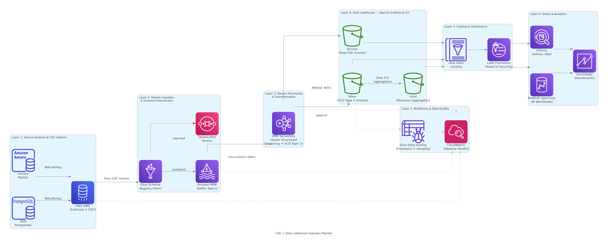

# CDC + Data Lakehouse Ingestion Pipeline — Systems Design

> A systems design interview-style document for a near-real-time CDC ingestion pipeline from operational databases into an Apache Iceberg data lakehouse on AWS.



---

## 1. Problem Statement & Requirements

### Context

A large enterprise operates 3–5 PostgreSQL and MySQL databases containing millions of customer, order, and inventory records across siloed systems. The data team needs a single analytical source of truth — a centralized data lakehouse — where business analysts and data scientists can query the freshest data without impacting production OLTP systems.

### Functional Requirements

- Capture every INSERT, UPDATE, and DELETE from source operational databases as a structured change event.
- Propagate changes to a centralized lakehouse with less than 5 minutes of end-to-end latency (source commit to queryable in Silver layer).
- Apply SCD Type 2 (Slowly Changing Dimension) semantics: maintain full history of row changes, never overwrite records.
- Enforce schema contracts at ingestion time — reject or quarantine records that violate the registered Avro schema.
- Organize data in a medallion architecture: Bronze (raw CDC events), Silver (deduplicated, SCD-applied), Gold (business-level aggregates).
- Support full historical backfill (initial load) and seamless transition to incremental CDC mode.
- Enable fine-grained access control: row-level and column-level security based on data classification.

### Non-Functional Requirements

| Dimension | Target |
|-----------|--------|
| **Freshness** | < 5 minutes from source commit to queryable in Silver layer |
| **Throughput** | ~100K CDC events/minute sustained (~1,700 events/sec); burst to 300K events/minute |
| **Availability** | >= 99.5% for the ingestion pipeline; Silver layer always queryable |
| **Durability** | Zero data loss; all CDC events persisted to Bronze layer before processing |
| **Correctness** | Exactly-once upsert semantics in Iceberg via MERGE INTO; no phantom records |
| **Schema safety** | Breaking schema changes rejected at produce time via Schema Registry |
| **Historical retention** | 5+ years; Iceberg time-travel for last 30 days; Glacier archive beyond |

### Scale Assumptions

- 10–50 source tables across 3–5 RDS/Aurora databases.
- Table sizes range from 10 GB to 10 TB.
- Average CDC payload: ~1 KB per change event.
- Average row change rate: 100K events/minute (~1.7 KB/s per table, ~170 MB/min total).
- Initial full-load volume: up to 10 TB (seeding Bronze layer via DMS full-load mode).
- Target Silver layer freshness: < 5 minutes; Gold layer: < 15 minutes.

---

## 2. High-Level Architecture

The pipeline is organized into **seven layers**, each with a clear responsibility boundary:

| # | Layer | Responsibility |
|---|-------|---------------|
| 1 | **Source Systems & CDC Capture** | RDS PostgreSQL and Aurora MySQL operational DBs; AWS DMS captures every row-level change as a structured CDC event |
| 2 | **Stream Ingestion & Schema Enforcement** | Amazon MSK (Kafka) as the streaming backbone; Glue Schema Registry validates Avro schemas at produce time |
| 3 | **Stream Processing & Transformation** | EMR Serverless running Spark Structured Streaming; applies SCD Type 2 logic, deduplication, and enrichment |
| 4 | **Data Lakehouse Storage (Iceberg)** | S3 + Apache Iceberg in Bronze/Silver/Gold medallion layers; ACID upserts via MERGE INTO |
| 5 | **Catalog & Governance** | Glue Data Catalog as the metastore; Lake Formation for fine-grained row/column-level access control |
| 6 | **Query & Analytics** | Athena (serverless SQL for ad-hoc), Redshift Spectrum (BI workloads), QuickSight (executive dashboards) |
| 7 | **Monitoring & Data Quality** | CloudWatch (pipeline health); Glue Data Quality (freshness, null rates, referential integrity checks) |

**Data flows left-to-right** through Layers 1–4 (the ingestion path), with Layers 5–6 providing governed read access across all three Iceberg tiers, and Layer 7 operating as a cross-cutting observability plane.

---

## 3. Component Deep Dive

### 3.1 Source Systems & CDC Capture

| Component | Service | Why This Choice |
|-----------|---------|----------------|
| Operational databases | **RDS PostgreSQL / Aurora MySQL** | Enterprise OLTP workloads; both engines support logical replication (PostgreSQL WAL, MySQL binlog) which DMS requires for CDC mode. |
| CDC engine | **AWS DMS** (Database Migration Service) | Managed CDC capture; native Kafka target endpoint; handles both full-load (initial seed) and ongoing CDC mode in a single replication task. |
| Change event routing | **DMS → MSK (Kafka)** | DMS writes CDC events directly to MSK topics using the Kafka target endpoint. No intermediate S3 landing zone needed for the streaming path. |

**DMS replication modes**:

| Mode | Purpose | Duration |
|------|---------|---------|
| **Full-load** | Seeds Bronze Iceberg tables from current DB snapshot | One-time, hours to days depending on table size |
| **CDC ongoing** | Streams all subsequent row changes as Avro events | Continuous, indefinitely |
| **Full-load + CDC** | Atomic transition: full load completes, then CDC begins seamlessly | Recommended for zero-gap migrations |

**DMS sizing**: `dms.r6i.xlarge` (4 vCPU, 32 GB) per replication instance; one instance per 2–3 source databases. CDC at 1,700 events/sec is well within `r6i.xlarge` capacity (~5,000 events/sec). Binlog retention on source must be >= 24 hours to survive DMS task restarts.

**Why DMS over self-managed Debezium on MSK Connect?** DMS is fully managed — no Kafka Connect worker cluster to operate, no JVM heap tuning, no connector restart orchestration. For teams not already running Kafka Connect, DMS eliminates an entire operational tier. Debezium is superior for Kafka-native stacks that already run MSK Connect, or when very low DMS task restart latency is needed (Debezium resumes from the last Kafka offset vs. DMS's coarser checkpoint).

### 3.2 Stream Ingestion & Schema Enforcement

| Component | Service | Why This Choice |
|-----------|---------|----------------|
| Streaming backbone | **Amazon MSK** (Managed Streaming for Apache Kafka) | DMS has a native Kafka target endpoint; Kafka's consumer group model provides flexible fan-out to multiple independent consumers (Spark Structured Streaming, monitoring, future consumers). |
| Schema registry | **AWS Glue Schema Registry** | Centrally managed Avro schema definitions; producers (DMS) serialize with registered schemas; consumers (Spark) deserialize safely; enforces compatibility rules at produce time. |
| Schema compatibility | **BACKWARD_TRANSITIVE** mode | Consumers running any schema version can always read records written with older schemas. Prevents consumer breakage during rolling schema updates. |

**MSK topic design**:

| Topic | Partitions | Retention | Description |
|-------|-----------|-----------|-------------|
| `cdc.<db_name>.<table_name>` | 12 | 7 days | One topic per source table; partition key = primary key hash for ordering per-row |
| `cdc.dlq` | 3 | 30 days | Dead-letter queue for schema-rejected or malformed events |

**MSK sizing**: `kafka.m5.xlarge` brokers (4 vCPU, 16 GB), 3-broker cluster, Multi-AZ. At 1,700 events/sec × 1 KB average = 1.7 MB/s total write. A 3×`m5.xlarge` cluster supports ~375 MB/s — vastly over-provisioned for current load but provides headroom for burst and cross-AZ replication.

**Why MSK over Kinesis Data Streams?** DMS has a native Kafka target but no native Kinesis target (it can only write to Kinesis via custom DMS mapping, with limited throughput). More importantly, the Kafka consumer group model provides built-in fan-out: Spark Structured Streaming, a monitoring consumer, and potential future real-time consumers can all independently read the same topics without the coordination overhead of Kinesis enhanced fan-out. At CDC scale, MSK's operational overhead is justified by the connector ecosystem and the fan-out model.

### 3.3 Stream Processing & Transformation

| Component | Service | Why This Choice |
|-----------|---------|----------------|
| Processing engine | **EMR Serverless** (Apache Spark Structured Streaming) | Serverless Spark eliminates cluster management; scales automatically to handle burst CDC volumes; supports Iceberg MERGE INTO natively via the Iceberg Spark runtime. |
| SCD Type 2 logic | **Spark MERGE INTO** (Iceberg) | Iceberg's MERGE INTO operation supports MATCHED/NOT MATCHED conditions; used to close the current record version and insert a new one atomically within a Spark batch. |
| Deduplication | **Watermarking + event time** | Spark Structured Streaming deduplicates within a configurable watermark window (default: 10 minutes) using the CDC event's `commit_timestamp` as event time and `primary_key + commit_lsn` as the dedup key. |

**SCD Type 2 logic per micro-batch**:

```
For each arriving CDC event (INSERT / UPDATE / DELETE):
  1. Match on primary_key in Silver Iceberg table WHERE is_current = true
  2. WHEN MATCHED (existing current record):
       - Set is_current = false, valid_to = event.commit_timestamp
  3. WHEN NOT MATCHED INSERT:
       - Insert new row with is_current = true, valid_from = event.commit_timestamp, valid_to = NULL
  4. For DELETE events:
       - Close current record (valid_to = event.commit_timestamp, is_current = false)
       - No new row inserted (record is logically deleted but history is preserved)
```

**EMR Serverless sizing**:
- Initial capacity: 4 driver vCPUs + 16 worker vCPUs (scales automatically).
- Micro-batch interval: 60 seconds per table (balances Iceberg commit overhead vs. freshness SLA).
- Max concurrency: 8 concurrent Spark applications (one per major table group).

**Why EMR Serverless over AWS Glue Streaming?** For heavy SCD Type 2 transforms that join CDC events against existing Iceberg snapshots (reading current-version records to close them), Spark needs significant state and executor memory. Glue Streaming's DPU-based pricing becomes expensive at the memory footprint required for these joins. EMR Serverless bills per vCPU-second and scales worker count dynamically, making it more cost-efficient for mixed-intensity workloads. It also provides full control over Spark configuration (memory fractions, shuffle partitions, Iceberg catalog properties).

### 3.4 Data Lakehouse Storage (Apache Iceberg)

| Component | Service | Why This Choice |
|-----------|---------|----------------|
| Object storage | **Amazon S3** | Virtually unlimited scale, low cost, native integration with Glue Catalog and all AWS analytics services. |
| Table format | **Apache Iceberg** | Open standard; ACID transactions + MERGE INTO semantics; schema evolution without rewriting data; partition evolution; time-travel (snapshot history); first-class support across Athena, Glue, and EMR. |
| Medallion layers | **Bronze / Silver / Gold** | Bronze = raw CDC events (immutable); Silver = SCD Type 2 history (current + historical versions); Gold = business aggregates (pre-joined, pre-aggregated for BI). |

**Medallion layer definitions**:

| Layer | Content | Write Pattern | Iceberg Features Used |
|-------|---------|--------------|----------------------|
| **Bronze** | Raw CDC events exactly as received from DMS/MSK; Avro → Parquet | Append-only (ACID insert) | Partitioned by `db_name`, `table_name`, `event_date` |
| **Silver** | SCD Type 2 history; one row per version of each business entity | MERGE INTO (upsert + close) | `is_current`, `valid_from`, `valid_to` columns; partitioned by `table_name`, `is_current` |
| **Gold** | Daily/hourly aggregates; business KPIs; denormalized reporting tables | Overwrite (snapshot isolation) | Partition by `report_date`; leverages Iceberg's overwrite-partition mode |

**Why Iceberg over Delta Lake or Hudi?**

| Factor | Iceberg | Delta Lake | Hudi |
|--------|---------|-----------|------|
| Athena support | Native (v2) | Via Glue connector (limited) | Via Glue connector (limited) |
| Glue Data Catalog | Native metastore integration | Supported | Supported |
| Schema evolution | Add/rename/drop columns without rewrite | Supported | Supported |
| Partition evolution | Yes — change partition strategy without rewriting | No | No |
| Vendor neutrality | Apache foundation, no vendor lock-in | Databricks-originated | Uber/Apache |
| **Verdict** | **Chosen**: best native AWS integration, open standard | Best if already on Databricks | Best for streaming upserts at very high throughput without MERGE INTO overhead |

**Iceberg maintenance**: AWS Glue ETL jobs run nightly for each Silver table to perform:
1. `CALL system.expire_snapshots(...)` — remove snapshots older than 30 days.
2. `CALL system.rewrite_data_files(...)` — compact small files produced by streaming micro-batches.
3. `CALL system.rewrite_manifests(...)` — refresh Iceberg manifest files for faster scan planning.

### 3.5 Catalog & Governance

| Component | Service | Why This Choice |
|-----------|---------|----------------|
| Metastore | **Glue Data Catalog** | Central Iceberg metastore shared by Athena, EMR, Redshift Spectrum; auto-populated by Glue Crawlers and Iceberg DDL operations. |
| Access control | **AWS Lake Formation** | Fine-grained row-level and column-level security enforced at query time; data classification tags (PII, CONFIDENTIAL) drive permission policies. |
| Column masking | **Lake Formation data filters** | Sensitive columns (SSN, credit card, email) masked or excluded for non-privileged roles; no application-level change required. |
| Schema contracts | **Glue Schema Registry** | Avro schema registry shared between DMS (producer) and Spark (consumer); BACKWARD_TRANSITIVE compatibility enforced. |

**Lake Formation permission model**:

| Role | Bronze Layer | Silver Layer | Gold Layer |
|------|-------------|-------------|-----------|
| Data Engineer | FULL (read/write) | FULL | FULL |
| Data Scientist | SELECT (non-PII columns only) | SELECT (non-PII) | SELECT |
| Business Analyst | None | None | SELECT (Gold only) |
| BI Service Account | None | None | SELECT |
| Auditor | SELECT (all columns, read-only) | SELECT | SELECT |

**Why Lake Formation over S3 bucket policies + IAM?** S3 bucket policies operate at the object level; they cannot enforce row-level or column-level restrictions. Lake Formation intercepts query engines (Athena, Glue, Redshift Spectrum) at the catalog layer and enforces data filters before query execution begins, without requiring data duplication or view proliferation.

### 3.6 Query & Analytics

| Component | Service | Why This Choice |
|-----------|---------|----------------|
| Ad-hoc SQL | **Amazon Athena** | Serverless; Iceberg v2 support; pay-per-query; used by data scientists and analysts for exploratory work and investigation. |
| BI workloads | **Redshift Spectrum** | Redshift cluster with Spectrum extension reads Iceberg tables directly from S3 via the Glue Catalog; used for dashboards that require sub-second query latency via Redshift's distribution/sort keys. |
| Dashboards | **Amazon QuickSight** | Managed BI tool; connects to Athena (ad-hoc) and Redshift (cached); SPICE engine for fast dashboard refresh. |

**Athena optimization for Iceberg**:
- Use `table_name.is_current = true` filter on Silver layer to read only current record versions (pruned by Iceberg partition).
- Enable Athena workgroup result caching (5-minute TTL) for repeated queries.
- Use Athena prepared statements for parameterized BI queries.

**Redshift Spectrum for Gold layer**: The Gold layer aggregates are pre-computed and small (typically < 100 GB per table), making them ideal for Redshift Spectrum's MPP scans. Redshift's AQUA (Advanced Query Accelerator) further accelerates common filter/aggregation patterns.

### 3.7 Monitoring & Data Quality

| Component | Service | Why This Choice |
|-----------|---------|----------------|
| Pipeline metrics | **CloudWatch** | MSK consumer lag, DMS replication lag, EMR Serverless application metrics, Iceberg commit success/failure rates. |
| Data quality checks | **Glue Data Quality** | Rule-based quality checks on Silver tables: freshness (max event age), null rates, referential integrity, uniqueness of primary keys in current records. |
| Alerting | **CloudWatch Alarms → SNS** | Configured alarms fan out to PagerDuty (on-call) and Slack (team channel) for pipeline failures and SLA breaches. |
| Audit logging | **CloudTrail + S3 Access Logs** | All Athena queries, Glue job executions, and Lake Formation access decisions logged for compliance. |

**Key CloudWatch alarms**:

| Alarm | Condition | Action |
|-------|-----------|--------|
| DMS replication lag > 2 min | Consumer falling behind source | Page on-call; investigate DMS task health |
| MSK consumer group lag > 10K messages | Spark processing stalled | Page on-call; check EMR Serverless application logs |
| Silver freshness > 5 min | SLA breach | Page on-call; trigger Spark job restart |
| Iceberg commit failure rate > 1% | Concurrent write conflicts | Alert data engineering team; review micro-batch concurrency |
| Glue Data Quality score < 0.95 | Data quality regression | Alert data engineering team; halt Gold layer promotion |
| Bronze → Silver row count drift > 5% | Possible data loss in pipeline | Page on-call; compare Bronze event count vs. Silver MERGE count |

---

## 4. Data Flow — Step by Step

A CDC event traverses the system in the following sequence:

```
Step  Component                         Action                                    Latency (cumulative)
────  ────────────────────────────────  ────────────────────────────────────────  ────────────────────
 1    Source DB (PostgreSQL/MySQL)       Row INSERT/UPDATE/DELETE committed         0 s
 2    DMS Replication Instance           Reads WAL/binlog; serializes to Avro       +2–5 s
 3    DMS → MSK Topic                    Writes Avro CDC event to Kafka topic        +1–2 s
 4    Glue Schema Registry               Schema validated at produce time            (inline, < 10 ms)
 5    MSK Topic                          Event persisted; available for consumers    +0 s (durable)
 6    EMR Serverless (Spark)             Micro-batch reads from MSK (60s interval)   +0–60 s
 7    Spark → Bronze Iceberg             Appends raw CDC event to Bronze table       +5–15 s
 8    Spark SCD Type 2 MERGE INTO        Applies MERGE INTO on Silver Iceberg table  +10–30 s
 9    Iceberg MERGE commit               ACID commit; snapshot atomically visible    +1–5 s
10    Glue Data Catalog                  Catalog metadata updated (automatic)        +0 s (live)
11    Athena / Redshift Spectrum         New records queryable via SELECT            +0 s
────                                                                               ────────────────────
      TOTAL (source commit → queryable)                                            ~1.5–2.5 min (p50)
                                                                                   ~4–5 min (p99)
```

**Freshness budget breakdown**:

| Hop | p50 | p99 | Notes |
|-----|-----|-----|-------|
| DMS capture (WAL → MSK) | 3 s | 7 s | DMS poll interval + serialization |
| MSK durable write | 1 s | 2 s | Replication acknowledgment |
| Spark micro-batch trigger | 0–60 s | 60 s | Worst case: event arrives just after batch start |
| Spark MERGE INTO execution | 15 s | 45 s | Depends on table size and conflict rate |
| Iceberg commit + catalog | 5 s | 10 s | Snapshot committed, catalog updated |
| **Total** | **~1.5 min** | **~2.5 min** | Well within 5-minute SLA |

**Initial full-load path** (one-time, parallel to CDC):
```
 F1   DMS Full-Load Task     Scans all source tables; writes to MSK full-load topics
 F2   Spark Batch Job         Reads full-load topics; inserts into Bronze + Silver Iceberg tables
 F3   DMS Transitions         After full-load completes, DMS switches to CDC mode seamlessly
 F4   CDC events merge        Ongoing CDC events MERGE INTO Silver alongside full-load records
```

---

## 5. Key Metrics

### 5.1 Throughput Targets

| Layer | Component | Sustained Target | Burst Capacity | Scaling Mechanism |
|-------|-----------|-----------------|---------------|-------------------|
| CDC Capture | DMS (`r6i.xlarge`) | 1,700 events/sec | 5,000 events/sec | Vertical scale or add replication instances |
| Streaming | MSK (3× `m5.xlarge`) | 1.7 MB/s write | 100 MB/s | Add brokers; increase partition count |
| Processing | EMR Serverless | 100K events/min | 300K events/min | Auto-scales worker count; no config needed |
| Bronze writes | Iceberg on S3 | 100K events/min | 300K events/min | S3 scales unboundedly |
| Silver MERGE | Iceberg MERGE INTO | Per table: ~10K rows/batch | 50K rows/batch | Increase micro-batch size; more executors |
| Query | Athena | 20 concurrent queries | 100 concurrent | Increase workgroup concurrency limit |

### 5.2 Freshness SLA

| Layer | Target | p50 Actual | p99 Actual | Buffer |
|-------|--------|-----------|-----------|--------|
| Bronze (raw CDC in S3) | < 2 min | ~1 min | ~1.5 min | 25% |
| Silver (MERGE INTO complete) | < 5 min | ~2.5 min | ~4 min | 20% |
| Gold (aggregates) | < 15 min | ~10 min | ~13 min | 13% |

### 5.3 Availability

| Component | SLA |
|-----------|-----|
| Amazon MSK | 99.9% (Multi-AZ) |
| AWS DMS | 99.9% |
| EMR Serverless | 99.9% |
| Amazon S3 | 99.99% |
| Glue Data Catalog | 99.9% |
| Athena | 99.9% |
| **Composite (ingestion path)** | **~99.6%** |

**Graceful degradation**: If EMR Serverless processing stalls, Bronze layer continues to accumulate events durably in MSK (7-day retention) and S3. Silver layer becomes stale but no data is lost. On Spark recovery, the consumer group resumes from the last committed Kafka offset and replays events idempotently via Iceberg's MERGE INTO.

### 5.4 Cost Estimate (~100K CDC events/minute sustained)

| Service | Configuration | Monthly Cost |
|---------|---------------|-------------|
| AWS DMS | 2× `r6i.xlarge` replication instances | $500 |
| Amazon MSK | 3× `kafka.m5.xlarge` brokers, Multi-AZ | $900 |
| EMR Serverless | ~300 vCPU-hrs/day (auto-scaled) | $600 |
| Amazon S3 | ~50 TB/month (Parquet + Iceberg metadata) | $1,200 |
| Glue ETL (maintenance) | 2× nightly compaction + expire jobs | $150 |
| Glue Data Quality | 50 tables × hourly checks | $200 |
| Glue Schema Registry | ~50 schemas, 500M serializations/month | $100 |
| Athena | ~100 TB scanned/month | $500 |
| Redshift Spectrum | 2× `ra3.xlplus` nodes | $700 |
| Lake Formation | Included in IAM/Glue costs | $0 |
| CloudWatch | Metrics, logs, alarms | $150 |
| **Total** | | **~$5,000/month** |

**Cost optimization levers**:
- **S3 Intelligent-Tiering**: Bronze layer data older than 90 days auto-moves to IA tier; saves ~40% on cold Bronze storage.
- **Iceberg file compaction**: Reduces number of small files → lowers S3 GET request costs and Athena scan costs by 30–50%.
- **EMR Serverless pre-initialized capacity**: Pre-warm 4 workers to eliminate cold-start latency during business hours; scale to zero overnight.
- **MSK Tiered Storage**: Move logs older than 24 hours to S3-backed MSK tiered storage at ~50% lower cost than broker storage.

---

## 6. Failure Modes & Mitigations

### 6.1 DMS Replication Lag / Task Failure (Binlog Position Loss)

| Aspect | Detail |
|--------|--------|
| **Cause** | DMS replication instance crash, network partition to source DB, or source binlog rotation before DMS consumes it |
| **Detection** | CloudWatch `CDCLatencySource` alarm > 2 minutes; DMS task status transitions to FAILED |
| **Mitigation** | DMS checkpoints replication state to its internal store; on restart, resumes from last saved LSN (Log Sequence Number). Source DB binlog retention must be >= 24 hours to survive restart window. DMS replication instance is Multi-AZ for HA. |
| **Recovery** | Auto-restart enabled on DMS task. If binlog has rotated past last checkpoint, task falls back to full-load + CDC mode (reseed from current snapshot). Iceberg MERGE INTO handles the re-inserted records idempotently. |
| **Blast radius** | CDC lag grows during recovery window (minutes to hours). No data loss if binlog is retained. Bronze/Silver become stale; MSK accumulates events for replay. |

### 6.2 Schema Drift — Source Column Type Change Breaks Avro Schema

| Aspect | Detail |
|--------|--------|
| **Cause** | A DBA adds/drops/renames a column or changes a column type in a source table without coordinating with the data team |
| **Detection** | Glue Schema Registry rejects the new record shape at DMS produce time → DMS routes event to dead-letter topic `cdc.dlq`; CloudWatch `DeadLetterQueueDepth` alarm fires |
| **Mitigation** | Schema Registry BACKWARD_TRANSITIVE compatibility: additive changes (new nullable column with default) are auto-approved. Breaking changes (type change, rename, non-nullable addition) are rejected; DMS writes to DLQ. |
| **Recovery** | Data engineer inspects DLQ; registers new schema version in Schema Registry; updates Iceberg Silver table schema via `ALTER TABLE`; replays DLQ events after schema update. |
| **Blast radius** | Rows with schema-breaking changes are quarantined in DLQ — not lost, not corrupted. Silver layer for affected table pauses updates for the duration of DLQ resolution (typically < 30 minutes with alerting). |

### 6.3 Large Transaction Burst Overwhelming MSK Partition Throughput

| Aspect | Detail |
|--------|--------|
| **Cause** | Bulk INSERT or batch UPDATE on source DB (e.g., year-end data migration, mass account status change) generates 10M+ CDC events in minutes |
| **Detection** | MSK `BytesInPerSec` alarm; Spark consumer lag grows; Silver freshness SLA breached |
| **Mitigation** | MSK consumer group processes at its own pace — events accumulate in Kafka (7-day retention). Spark auto-scales worker count via EMR Serverless. DMS has configurable LOB settings and batch size to avoid overwhelming MSK partitions per-topic. |
| **Recovery** | Spark catches up on the backlog at full worker capacity. Freshness temporarily degrades but recovers as burst subsides. No data loss. |
| **Blast radius** | Silver layer freshness temporarily exceeds 5-minute SLA during burst (recovers within 30–60 minutes). Bronze layer unaffected. Gold layer promotion paused until Silver catches up. |

### 6.4 Iceberg Commit Conflicts During Concurrent Spark Micro-Batches

| Aspect | Detail |
|--------|--------|
| **Cause** | Multiple Spark applications writing to the same Iceberg table simultaneously produce conflicting snapshot commits (optimistic concurrency conflict) |
| **Detection** | Iceberg `CommitFailedRetryException` in Spark logs; CloudWatch `IcebergCommitFailureRate` custom metric > 1% |
| **Mitigation** | Iceberg uses optimistic concurrency control: one writer wins, the other retries. Retry is automatic with exponential backoff (default 3 retries). Partition-level write isolation: different Spark apps should write to disjoint partition ranges (e.g., one app per source table group). |
| **Recovery** | Automatic retry succeeds in nearly all cases. If persistent conflicts occur, serialize Spark jobs by adding EMR Serverless job dependency. |
| **Blast radius** | Minor latency increase during retry (seconds). If all retries fail, the micro-batch is requeued from Kafka offset. No data corruption — Iceberg's ACID semantics ensure partial commits never become visible. |

### 6.5 Data Quality Regression — NULL Constraint Violations / Referential Integrity Breaks

| Aspect | Detail |
|--------|--------|
| **Cause** | Source application bug or schema migration inserts records with NULL values in previously non-nullable columns; or foreign key references deleted records |
| **Detection** | Glue Data Quality hourly check detects null rate > threshold or referential integrity failure; quality score drops below 0.95; CloudWatch alarm fires |
| **Mitigation** | Glue Data Quality rules quarantine failing rows to a separate `silver_quarantine` Iceberg table rather than blocking the entire pipeline. Clean rows continue to the Silver layer. |
| **Recovery** | Data engineer investigates quarantine table, fixes source data or adjusts quality rules, and re-processes quarantined rows via a targeted Spark job. |
| **Blast radius** | Affected rows missing from Silver/Gold layers until resolved. Quarantine table provides full visibility. Gold layer promotions that depend on affected Silver tables are paused. |

---

## 7. Trade-offs & Alternatives

### 7.1 Why MSK over Kinesis Data Streams?

| Factor | Amazon MSK | Kinesis Data Streams |
|--------|-----------|---------------------|
| DMS integration | Native Kafka target endpoint | No native target; requires Lambda bridge |
| Fan-out model | Consumer groups (independent, no throughput penalty) | Enhanced fan-out (~$0.015/shard-hr extra) |
| Throughput ceiling | Horizontal (add brokers/partitions) | Vertical (add shards at 1 MB/s each) |
| Operational overhead | Broker maintenance, version upgrades | Fully managed |
| Connector ecosystem | Full Kafka Connect ecosystem (Debezium, etc.) | Limited |
| Cost at 1.7 MB/s | ~$900/month (3-broker cluster) | ~$300/month (2 shards) |
| **Verdict** | **Chosen**: DMS native target, connector ecosystem, fan-out model | Better if DMS is not used and operational simplicity is paramount |

### 7.2 Why Apache Iceberg over AWS Glue Parquet (Append-Only)?

| Factor | Apache Iceberg | Glue Parquet (Append-Only) |
|--------|---------------|--------------------------|
| ACID upserts | MERGE INTO semantics | Not supported natively |
| Schema evolution | Add/rename/drop without data rewrite | Requires rewrite or new partition |
| Partition evolution | Change strategy without data rewrite | Requires rewrite |
| Time-travel | Built-in snapshot history | Not supported |
| Delete/update support | Full DML support | Append-only; requires manual dedup |
| Query performance | Predicate pushdown, metadata pruning | Comparable for append workloads |
| **Verdict** | **Chosen**: SCD Type 2 and CDC upserts require ACID semantics | Sufficient for append-only event logs (e.g., fraud detection pipeline) |

### 7.3 Why EMR Serverless over AWS Glue Streaming?

| Factor | EMR Serverless | AWS Glue Streaming |
|--------|---------------|-------------------|
| Iceberg MERGE INTO | Full support (native Spark 3.x + Iceberg runtime) | Supported but with higher DPU cost for stateful joins |
| Pricing | Per vCPU-second (granular) | Per DPU-hour (minimum 2 DPUs) |
| Configuration control | Full Spark tuning (memory, shuffle, catalog) | Limited by Glue managed environment |
| SCD Type 2 joins | Efficient with controlled executor count | DPU billing makes memory-intensive joins expensive |
| Cold start | ~30–60 s (pre-initialized workers available) | ~2–5 min |
| **Verdict** | **Chosen**: SCD Type 2 MERGE joins require memory control; cost model better at scale | Better for simpler append-to-S3 transformations with minimal state |

### 7.4 Why Lake Formation over S3 Bucket Policies + IAM?

| Factor | Lake Formation | S3 Bucket Policies + IAM |
|--------|---------------|--------------------------|
| Row-level security | Supported (data filters) | Not supported |
| Column-level masking | Supported (column exclusion, masking) | Not supported |
| PII enforcement | Tag-based: apply once, inherit by new tables | Must update every bucket policy manually |
| Query engine support | Athena, Redshift Spectrum, Glue (all enforced) | S3-level only; bypassed by direct S3 access patterns |
| Operational overhead | Medium (initial setup; low ongoing) | Low for simple cases; high for large table counts |
| **Verdict** | **Chosen**: row/column security is a hard requirement for PII data | Sufficient for coarse-grained (table/bucket-level) access control only |

---

## 8. Data Consistency Considerations

### 8.1 At-Least-Once CDC and Idempotent Upserts

AWS DMS provides **at-least-once delivery**: in failure/retry scenarios, a CDC event may be delivered to MSK more than once. Spark Structured Streaming itself provides exactly-once semantics within a single micro-batch (via Kafka offset checkpointing), but cross-batch duplicates can occur if a batch fails after committing to Kafka but before committing to Iceberg.

Iceberg's MERGE INTO is inherently **idempotent** for CDC events:
- A duplicate INSERT event for an already-existing primary key with `is_current = true` will be detected as MATCHED and will attempt to close the current record and insert a new one with the same values — a no-op at the data level.
- Deduplication is enforced by filtering out events where `(primary_key, commit_lsn)` already exists in the Bronze layer before MERGE.

### 8.2 SCD Type 2 Ordering and Late-Arriving Events

CDC events arrive in Kafka partitions ordered by LSN (Log Sequence Number) per partition, but a consumer processing multiple partitions may encounter out-of-order arrival across partitions. Spark's watermarking ensures that events older than the watermark threshold (10 minutes) are dropped rather than applied — protecting Silver layer correctness at the cost of occasionally discarding very late events.

**Late event handling**: Events arriving beyond the watermark are routed to a `silver_late_events` Iceberg table for manual review. An analyst can decide whether to apply them retroactively (triggering a targeted MERGE) or discard them.

### 8.3 Iceberg Snapshot Isolation and Read Consistency

Iceberg uses **snapshot isolation** for reads: a query always reads a consistent snapshot, even if a MERGE INTO is committing concurrently. This means:
- Athena queries see either the pre-MERGE or post-MERGE state — never a partial write.
- Long-running Athena queries that span multiple Spark MERGE cycles will use the snapshot that was current when the query started.
- **Time-travel** allows auditors to query the exact state of any Silver table at any historical `commit_timestamp` using `FOR TIMESTAMP AS OF` syntax.

### 8.4 Full-Load to CDC Transition Consistency

The DMS "full-load + CDC" mode manages the transition atomically: DMS records the LSN at which the full-load snapshot was taken, then begins replaying CDC events from that exact LSN once the full-load is committed to Bronze. This ensures no gap exists between the snapshot and the CDC stream.

Iceberg MERGE INTO handles the case where a full-load event and a subsequent CDC event for the same row arrive in the same micro-batch: the CDC event's higher `commit_lsn` wins, and the full-load event is treated as the initial version (valid_from = full-load time, valid_to = CDC event time).

### 8.5 Schema Evolution Consistency

Iceberg's schema evolution is backward-compatible for readers: adding a nullable column to a Silver Iceberg table means existing Parquet files simply return NULL for that column — no rewrite required. This is consistent with Glue Schema Registry's BACKWARD_TRANSITIVE mode, where consumers can always read older records with the latest schema definition.

Column drops and renames require schema migration coordination: the Iceberg table schema is updated via `ALTER TABLE`, existing Parquet files remain (they use column IDs, not names internally), and Spark readers transparently handle the remapping.

---

## Appendix: Architecture Diagram Legend

| Visual Element | Meaning |
|----------------|---------|
| Solid arrow | Primary data flow (synchronous or near-real-time) |
| Cluster box | Logical layer boundary |
| Bronze/Silver/Gold labels | Medallion lakehouse tiers |
| Dashed boundary | Governance and access control overlay |
