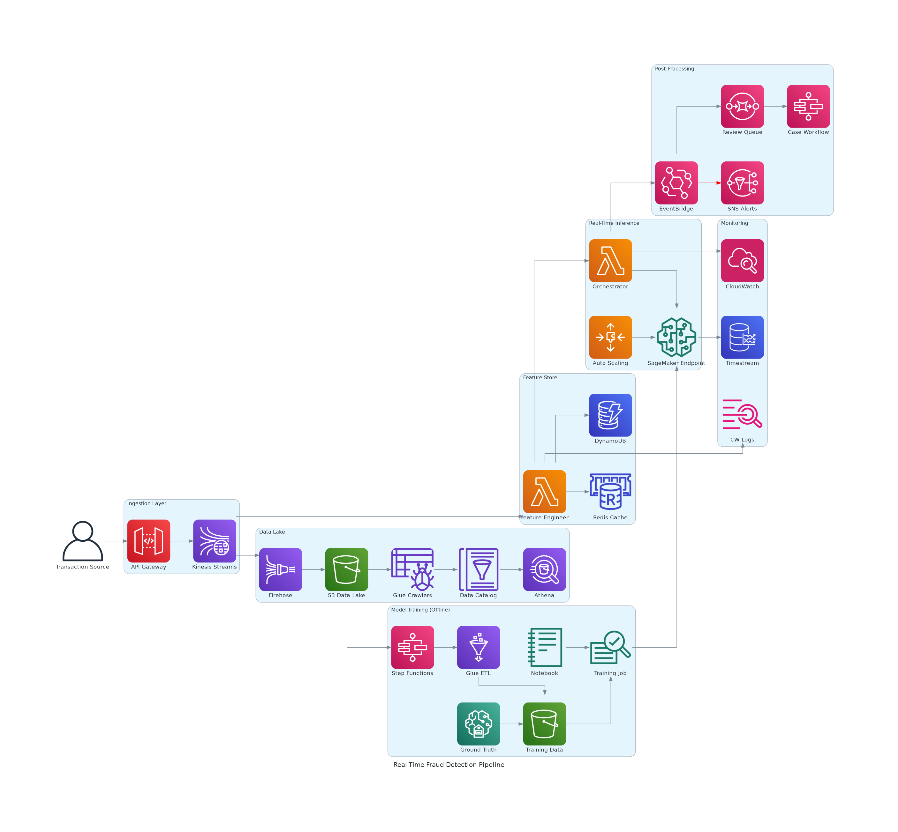

# Real-Time Fraud Detection Pipeline — Systems Design

> A systems design interview-style document for a real-time ML fraud detection pipeline on AWS.



---

## 1. Problem Statement & Requirements

### Functional Requirements

- Score every financial transaction in real time (< 200 ms end-to-end) before authorization.
- Enrich each transaction with historical features (e.g., rolling 24-hour spend, device fingerprint frequency, merchant risk score).
- Route scored transactions: **approve**, **decline**, or **send to manual review**.
- Alert fraud analysts immediately for high-confidence fraud.
- Store all decisions for downstream auditing, compliance, and model retraining.
- Support an offline model training loop that continuously improves the model.

### Non-Functional Requirements

| Dimension | Target |
|-----------|--------|
| **Throughput** | 5,000–10,000 transactions per second (TPS) sustained, 25,000 TPS peak |
| **Latency** | p50 < 50 ms, p99 < 100 ms, hard ceiling 200 ms |
| **Availability** | >= 99.9% (fraud scoring path); graceful degradation to rule-based fallback |
| **Durability** | Zero data loss on transaction records (compliance) |
| **Freshness** | Feature store updated within 1 second of transaction |
| **Model update** | New model deployed within 1 hour of training completion |

### Scale Assumptions

- ~400 M transactions/day (~5,000 TPS average).
- Average payload: 2 KB per transaction.
- Feature vector: ~200 features, 1 KB serialized.
- Model size: ~50 MB (XGBoost ensemble or lightweight neural net).

---

## 2. High-Level Architecture

The pipeline is organized into **seven layers**, each with a clear responsibility boundary:

| # | Layer | Responsibility |
|---|-------|---------------|
| 1 | **Ingestion** | Accept transactions, authenticate, buffer into a streaming backbone |
| 2 | **Feature Store** | Enrich transactions with real-time and historical features |
| 3 | **Real-Time Inference** | Score the enriched feature vector against the deployed ML model |
| 4 | **Post-Processing & Actions** | Route decisions (approve/decline/review), alert analysts, trigger case workflows |
| 5 | **Data Lake & Compliance** | Archive all raw and scored events for audit, analytics, and retraining |
| 6 | **Model Training (Offline)** | Periodically retrain and deploy improved models using labeled data |
| 7 | **Monitoring & Observability** | Track latency, throughput, model accuracy drift, and system health |

**Data flows left-to-right** through Layers 1–4 (the hot path), with a parallel branch from Layer 1 into Layer 5 (the warm path), and a feedback loop from Layer 5 into Layer 6 (the cold path).

---

## 3. Component Deep Dive

### 3.1 Ingestion Layer

| Component | Service | Why This Choice |
|-----------|---------|----------------|
| Entry point | **API Gateway** (REST) | Managed TLS termination, request validation, throttling, API key auth. Supports 10,000 RPS per region with burst to 5,000 concurrent. |
| Streaming backbone | **Kinesis Data Streams** | Ordered, durable, replayable stream. Chosen over SQS (need ordering + fan-out) and MSK (simpler ops, sufficient throughput). |

**Kinesis sizing**: 20 shards at 1 MB/s write each = 20 MB/s = ~10,000 TPS at 2 KB/event. Enhanced fan-out for independent consumer reads without contention.

**Why not Amazon MSK?** MSK provides higher throughput ceilings but adds operational complexity (broker management, partition rebalancing, ZooKeeper/KRaft). For 5K–10K TPS with < 5 consumers, Kinesis is simpler and cheaper.

### 3.2 Feature Store

| Component | Service | Why This Choice |
|-----------|---------|----------------|
| Feature engineer | **Lambda** (triggered by Kinesis) | Event-driven, scales with shard count, sub-100 ms cold start with SnapStart/provisioned concurrency. |
| Real-time cache | **ElastiCache for Redis** (cluster mode) | Sub-millisecond reads for hot features (rolling aggregates, device fingerprints). 6-node cluster, r6g.xlarge (~200K ops/sec). |
| Durable store | **DynamoDB** | Single-digit ms reads for historical features. On-demand capacity mode handles spikes. Point-in-time recovery for compliance. |

**Feature engineering flow**:
1. Lambda receives transaction from Kinesis.
2. Reads customer profile + rolling aggregates from Redis (p99 < 1 ms).
3. Falls back to DynamoDB if Redis cache miss (p99 < 5 ms).
4. Computes derived features (velocity, geo-distance, merchant risk).
5. Writes updated rolling aggregates back to Redis.
6. Passes enriched feature vector to inference orchestrator.

**Why Lambda over ECS/Fargate?** At this stage the work is stateless and bursty. Lambda's per-invocation billing and automatic scaling from Kinesis shard count (1 Lambda per shard) maps perfectly. An ECS service would require capacity planning and adds idle cost.

### 3.3 Real-Time Inference

| Component | Service | Why This Choice |
|-----------|---------|----------------|
| Orchestrator | **Lambda** | Invokes SageMaker endpoint, applies business rules on top of model score, publishes decision. |
| Model endpoint | **SageMaker Real-Time Inference** | Managed model hosting with auto-scaling. Supports A/B testing (production variant routing) and shadow mode for safe deployments. |
| Auto scaling | **Application Auto Scaling** | Target-tracking on `InvocationsPerInstance` metric. Scale from 2 to 20 instances of ml.c5.xlarge. |

**Inference latency budget**:

| Hop | p50 | p99 |
|-----|-----|-----|
| Lambda invoke overhead | 1 ms | 3 ms |
| Network to SageMaker | 1 ms | 2 ms |
| Model inference (XGBoost) | 2 ms | 5 ms |
| Business rule evaluation | 1 ms | 2 ms |
| **Subtotal** | **5 ms** | **12 ms** |

**Why SageMaker over Lambda-hosted model?** SageMaker provides model versioning, A/B deployment, auto-scaling on inference metrics, and GPU/Inferentia support for future model upgrades. Lambda-hosted models hit memory limits (~10 GB) and lack native ML deployment tooling.

### 3.4 Post-Processing & Actions

| Component | Service | Why This Choice |
|-----------|---------|----------------|
| Decision router | **EventBridge** | Content-based routing on score thresholds. Decouples scoring from downstream actions. |
| Fraud alerts | **SNS** | Fan-out to multiple subscribers (email, SMS, PagerDuty, Slack webhook). |
| Review queue | **SQS** | Buffers manual-review cases for analyst dashboards. Dead-letter queue for failures. |
| Case workflow | **Step Functions** | Orchestrates multi-step investigation: assign analyst, collect evidence, record decision, update model labels. |

**Decision thresholds** (configurable via SSM Parameter Store):

| Score Range | Action |
|-------------|--------|
| 0.0 – 0.3 | Approve (auto) |
| 0.3 – 0.7 | Manual review → SQS |
| 0.7 – 1.0 | Decline + alert → SNS |

### 3.5 Data Lake & Compliance

| Component | Service | Why This Choice |
|-----------|---------|----------------|
| Delivery | **Kinesis Data Firehose** | Zero-ops delivery from Kinesis to S3. Handles batching, compression (Snappy), format conversion (Parquet). |
| Storage | **S3** | Columnar Parquet files partitioned by `date/hour`. Lifecycle policies: Standard → IA (90 days) → Glacier (1 year). |
| Schema discovery | **Glue Crawlers** | Auto-detect schema changes and update the catalog. Scheduled hourly. |
| Metadata | **Glue Data Catalog** | Central schema registry. Shared by Athena, Glue ETL, and Redshift Spectrum. |
| Ad-hoc query | **Athena** | Serverless SQL over S3. Used by fraud analysts for investigation and by data scientists for exploratory analysis. |

**Compliance**: All records are immutable in S3 with Object Lock (WORM). Versioning enabled. Access logged via CloudTrail.

### 3.6 Model Training Pipeline (Offline)

| Component | Service | Why This Choice |
|-----------|---------|----------------|
| Orchestrator | **Step Functions** | Coordinates the multi-step training pipeline with error handling and retry logic. |
| Data preparation | **Glue ETL** | Spark-based ETL to join transaction data with analyst labels. Outputs balanced training dataset. |
| Training data | **S3** | Versioned training datasets for reproducibility. |
| Training | **SageMaker Training Job** | Managed training with spot instances (70% cost reduction). Automatic hyperparameter tuning. |
| Experimentation | **SageMaker Notebook** | Jupyter notebooks for data scientists to prototype and validate models. |
| Labeling | **SageMaker Ground Truth** | Human-in-the-loop labeling for ambiguous cases. Active learning to prioritize the most informative samples. |

**Training cadence**: Weekly full retrain + daily incremental update. Champion/challenger deployment: new model serves 5% of traffic in shadow mode before promotion.

**Retraining trigger**: Model drift detected when precision drops below 95% or recall drops below 90% (monitored via Timestream).

### 3.7 Monitoring & Observability

| Component | Service | Why This Choice |
|-----------|---------|----------------|
| Metrics & alarms | **CloudWatch** | System metrics (Lambda duration, Kinesis iterator age, SageMaker latency). Custom metrics (score distribution, feature nulls). |
| Logs | **CloudWatch Logs** | Centralized logging from all Lambda functions and SageMaker endpoints. |
| Model performance | **Timestream** | Time-series DB for model accuracy metrics (precision, recall, F1) tracked over time. Enables drift detection with temporal queries. |

**Key alarms**:

| Alarm | Condition | Action |
|-------|-----------|--------|
| Kinesis iterator age > 30 s | Consumer falling behind | Page on-call, scale Lambda concurrency |
| SageMaker p99 latency > 50 ms | Inference slow | Scale out endpoint instances |
| Model precision < 95% | Model drift | Trigger retraining pipeline |
| Feature null rate > 5% | Data quality issue | Alert data engineering team |
| End-to-end p99 > 150 ms | Approaching SLA ceiling | Page on-call |

---

## 4. Data Flow — Step by Step

A transaction traverses the system in the following sequence:

```
Step  Component                     Action                                    Latency (p50/p99)
────  ────────────────────────────  ────────────────────────────────────────  ─────────────────
 1    Client → API Gateway          HTTPS POST /v1/transactions               5 ms / 10 ms
 2    API Gateway → Kinesis         PutRecord (2 KB payload)                  3 ms / 8 ms
 3    Kinesis → Feature Engineer    Lambda trigger (event-source mapping)     8 ms / 15 ms
 4    Feature Engineer → Redis      GET rolling aggregates                    1 ms / 2 ms
 5    Feature Engineer → DynamoDB   GET customer profile                      3 ms / 5 ms
 6    Feature Engineer → Lambda     Compute derived features                  2 ms / 5 ms
 7    Orchestrator → SageMaker      InvokeEndpoint (feature vector)           5 ms / 12 ms
 8    Orchestrator → EventBridge    PutEvents (score + decision)              3 ms / 5 ms
 9a   EventBridge → SNS            Alert (if score > 0.7)                    5 ms / 10 ms
 9b   EventBridge → SQS            Enqueue review (if 0.3 < score < 0.7)    2 ms / 5 ms
────                                                                         ─────────────────
      TOTAL (hot path, steps 1–8)                                            30 ms / 62 ms
```

**Parallel warm path** (async, non-blocking):
```
 W1   Kinesis → Firehose           Enhanced fan-out consumer                  —
 W2   Firehose → S3                Buffered write (60s or 128 MB)             —
 W3   S3 → Glue Crawler            Hourly schema update                       —
 W4   Glue Catalog → Athena        Available for ad-hoc query                 —
```

---

## 5. Key Metrics

### 5.1 Throughput Targets

| Layer | Component | Target | Scaling Mechanism |
|-------|-----------|--------|-------------------|
| Ingestion | API Gateway | 10,000 RPS | Regional limit increase |
| Ingestion | Kinesis | 10,000 TPS (20 shards) | Shard splitting |
| Feature Store | Lambda | 20 concurrent (1 per shard) | Provisioned concurrency |
| Feature Store | Redis | 200,000 ops/sec | Cluster mode, read replicas |
| Inference | SageMaker | 2,000 TPS per ml.c5.xlarge | Auto Scaling (2–20 instances) |
| Post-Processing | EventBridge | 10,000 events/sec | Managed, scales automatically |
| Data Lake | Firehose | 10,000 records/sec | Auto-scales |

### 5.2 Latency Breakdown

| Percentile | End-to-End | Budget | Status |
|------------|-----------|--------|--------|
| p50 | ~30 ms | < 50 ms | Within budget |
| p95 | ~50 ms | < 80 ms | Within budget |
| p99 | ~62 ms | < 100 ms | Within budget |
| p99.9 | ~90 ms | < 200 ms | Within budget |

### 5.3 Availability

**Composite SLA calculation** (hot path, serial dependencies):

| Component | SLA |
|-----------|-----|
| API Gateway | 99.95% |
| Kinesis Data Streams | 99.9% |
| Lambda | 99.95% |
| ElastiCache Redis | 99.9% (Multi-AZ) |
| SageMaker Endpoint | 99.9% |
| EventBridge | 99.99% |
| **Composite (product)** | **~99.6%** |

**Graceful degradation strategy**: If SageMaker is unavailable, the orchestrator Lambda falls back to a rule-based scoring engine (cached in Lambda memory). This raises effective availability to **~99.9%** for the scoring function, though with reduced accuracy.

### 5.4 Cost Estimate (~5,000 TPS sustained)

| Service | Configuration | Monthly Cost |
|---------|---------------|-------------|
| API Gateway | 13B requests/month | $1,500 |
| Kinesis Data Streams | 20 shards + enhanced fan-out | $800 |
| Lambda (Feature + Orchestrator) | 13B invocations, 128 MB, 50 ms avg | $1,300 |
| ElastiCache Redis | 6x r6g.xlarge (Multi-AZ) | $1,600 |
| DynamoDB | On-demand, ~5,000 RCU avg | $400 |
| SageMaker Endpoints | 4x ml.c5.xlarge (avg) | $700 |
| Kinesis Firehose | 13B records → S3 | $200 |
| S3 (data lake) | ~50 TB/month (Parquet compressed) | $250 |
| CloudWatch / Timestream | Metrics, logs, alarms | $200 |
| Glue / Athena / Step Functions | ETL + queries + workflows | $150 |
| **Total** | | **~$7,100/month** |

**Cost optimization levers**:
- **Savings Plans**: 1-year compute savings plan reduces Lambda + SageMaker by ~30% → saves ~$600/month.
- **Kinesis On-Demand mode**: Eliminates shard management but costs ~20% more; trade-off is operational simplicity.
- **SageMaker Spot Endpoints**: Not recommended for real-time inference (interruption risk), but saves 70% on training jobs.
- **S3 Intelligent-Tiering**: Auto-moves cold data; saves ~40% on storage after 90 days.

---

## 6. Failure Modes & Mitigations

### 6.1 SageMaker Endpoint Unavailable

| Aspect | Detail |
|--------|--------|
| **Cause** | Deployment failure, scaling event, AZ outage |
| **Detection** | CloudWatch `Invocation5XXErrors` alarm, p99 latency spike |
| **Mitigation** | Orchestrator Lambda falls back to rule-based engine (pre-loaded rules in memory). Rules cover top 20 fraud patterns (80% of detections). |
| **Recovery** | SageMaker auto-heals; if persistent, rollback to previous model version via deployment config. |
| **Blast radius** | Reduced detection accuracy (rule-based precision ~85% vs. model ~97%). No data loss. |

### 6.2 Redis Cluster Failure

| Aspect | Detail |
|--------|--------|
| **Cause** | Primary node failure, network partition |
| **Detection** | ElastiCache `ReplicationLag` alarm, connection errors in Lambda logs |
| **Mitigation** | Multi-AZ with automatic failover (< 30 s). Feature engineer falls back to DynamoDB for all reads. |
| **Recovery** | Redis auto-promotes replica. Cache warms organically from DynamoDB reads. |
| **Blast radius** | Latency increase (~5 ms → ~10 ms per feature lookup). No data loss (DynamoDB is the source of truth). |

### 6.3 Kinesis Throttling / Hot Shard

| Aspect | Detail |
|--------|--------|
| **Cause** | Uneven partition key distribution, traffic spike exceeding shard capacity |
| **Detection** | `WriteProvisionedThroughputExceeded` metric, Kinesis iterator age increasing |
| **Mitigation** | Use random partition suffix (e.g., `customer_id + random(0-9)`) to distribute load. API Gateway returns 429 with Retry-After header. |
| **Recovery** | Shard splitting (doubles capacity). On-demand mode auto-scales but with higher per-record cost. |
| **Blast radius** | Delayed scoring for affected partition. No data loss (API Gateway retries + client backoff). |

### 6.4 Model Drift

| Aspect | Detail |
|--------|--------|
| **Cause** | Fraud pattern evolution, seasonal behavior shifts, data distribution change |
| **Detection** | Timestream query: precision/recall/F1 computed hourly on labeled subset. Alert if precision < 95% or recall < 90%. |
| **Mitigation** | Automated retraining trigger via Step Functions. Champion/challenger deployment limits blast radius. |
| **Recovery** | New model trained on recent data, deployed as challenger (5% traffic), promoted after validation. |
| **Blast radius** | Gradually increasing false positives or false negatives until new model is deployed (typically < 24 hours). |

### 6.5 Lambda Cold Start Spike

| Aspect | Detail |
|--------|--------|
| **Cause** | Traffic burst after quiet period, deployment update |
| **Detection** | CloudWatch `InitDuration` metric spike |
| **Mitigation** | Provisioned concurrency (20 instances for feature engineer, 20 for orchestrator). SnapStart for Java runtimes. |
| **Recovery** | Automatic after first invocation. Provisioned concurrency eliminates the issue for steady-state. |
| **Blast radius** | 200–500 ms added latency for cold-start invocations. Affects < 0.1% of requests with provisioned concurrency. |

---

## 7. Trade-offs & Alternatives

### 7.1 Why Kinesis over MSK (Managed Kafka)?

| Factor | Kinesis | MSK |
|--------|---------|-----|
| Ops overhead | Fully managed, shard-based | Broker management, partition tuning |
| Throughput | 1 MB/s per shard (scalable) | Higher ceiling (100+ MB/s) |
| Consumer model | Enhanced fan-out (dedicated throughput) | Consumer groups (shared) |
| Cost at 5K TPS | ~$800/month | ~$1,500/month (3-broker minimum) |
| **Verdict** | **Chosen**: simpler ops, sufficient throughput | Better for > 50K TPS or complex event processing |

### 7.2 Why Lambda over ECS/Fargate for Feature Engineering?

| Factor | Lambda | ECS/Fargate |
|--------|--------|-------------|
| Scaling | Automatic per Kinesis shard | Requires scaling policies |
| Cold start | ~100 ms (mitigated with provisioned concurrency) | 30–60 s container start |
| Cost model | Per-invocation (pay only for compute time) | Per-hour (pay for idle capacity) |
| Max duration | 15 min | Unlimited |
| **Verdict** | **Chosen**: stateless, bursty workload fits Lambda perfectly | Better for long-running or stateful workloads |

### 7.3 Why Real-Time Scoring over Batch Pre-scoring?

| Factor | Real-Time | Batch Pre-scoring |
|--------|-----------|-------------------|
| Latency | < 100 ms | Hours (batch window) |
| Feature freshness | Real-time rolling aggregates | Stale by hours |
| Coverage | Scores every transaction | Must pre-compute for all customers |
| Cost | Higher (always-on endpoints) | Lower (periodic compute) |
| **Verdict** | **Chosen**: fraud requires real-time signals (velocity, recent behavior) | Acceptable for risk scoring in non-real-time contexts (e.g., credit decisions) |

### 7.4 Why Separate Feature Store (Redis + DynamoDB) over SageMaker Feature Store?

| Factor | Redis + DynamoDB | SageMaker Feature Store |
|--------|-----------------|------------------------|
| Read latency | < 1 ms (Redis), < 5 ms (DynamoDB) | 10–50 ms (online store) |
| Control | Full control over TTL, eviction, schema | Managed, opinionated |
| Cost | ~$2,000/month | Comparable, but less predictable |
| Offline/online sync | Manual (Glue ETL) | Built-in |
| **Verdict** | **Chosen**: sub-ms latency critical for p99 budget | Better when offline/online consistency is the primary concern |

---

## 8. Data Consistency Considerations

### 8.1 Feature Store: Eventual Consistency

The feature store operates under **eventual consistency**:

- **Redis** is the hot cache, updated synchronously by the feature engineer Lambda after each transaction.
- **DynamoDB** is the durable store, updated asynchronously (or synchronously for critical features like account balance).
- **Staleness window**: Features in Redis may be up to ~1 second ahead of DynamoDB during normal operation.
- **Impact**: A transaction scored during the consistency window may use slightly stale features. For fraud detection, this is acceptable — the model is trained on similarly delayed features.

### 8.2 At-Least-Once Delivery & Deduplication

Kinesis provides **at-least-once delivery** to Lambda:

- **Duplicate handling**: Each transaction carries an idempotency key (`transaction_id`). The feature engineer Lambda checks Redis for a recent processing record before re-processing.
- **Dedup window**: 5-minute TTL in Redis for processed transaction IDs.
- **Data lake impact**: Firehose may deliver duplicate records to S3. Deduplication is applied during Glue ETL (using `transaction_id` + `timestamp` as a composite key) before training data preparation.

### 8.3 Model Deployment Consistency

During model updates, a **blue/green deployment** strategy prevents inconsistency:

1. New model is deployed as a SageMaker production variant with 0% initial weight.
2. Traffic is gradually shifted (5% → 25% → 50% → 100%) over 4 hours.
3. If the new model's precision drops below threshold during ramp-up, traffic is automatically routed back to the old model.
4. Both models score the same feature vector format — no feature store changes needed for model updates.

### 8.4 Compliance & Audit Trail

- Every transaction and its fraud score are immutably stored in S3 (Object Lock, WORM compliance mode).
- DynamoDB Streams + Lambda archives all feature store mutations to S3 for regulatory replay.
- Athena enables querying the full decision history for any transaction within seconds.
- Retention: 7 years (configurable per regulatory jurisdiction).

---

## Appendix: Architecture Diagram Legend

| Visual Element | Meaning |
|----------------|---------|
| Solid arrow | Primary data flow (synchronous) |
| Red arrow | Fraud alert path (high-confidence decline) |
| Dashed arrow | Asynchronous / eventual consistency |
| Dotted gray arrow | Monitoring / observability telemetry |
| Cluster box | Logical layer boundary |
